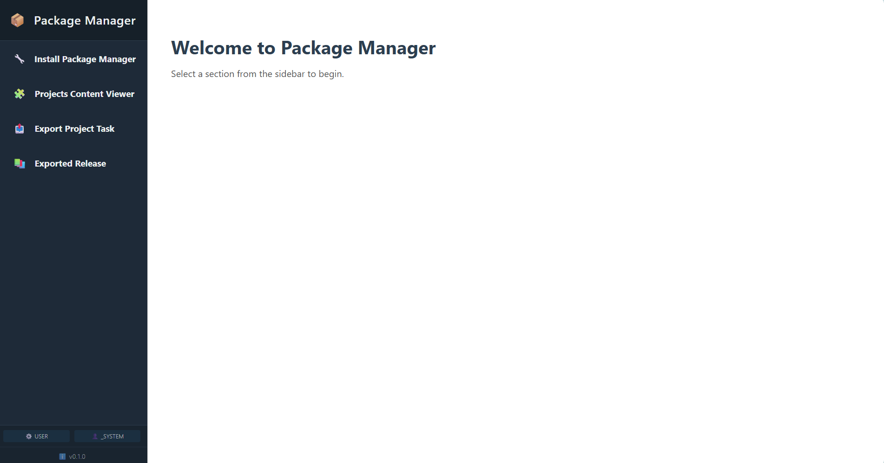

# 📦 IRIS Package Manager

The IRIS Package Manager is a web-based application that simplifies the management and export of code assets within an InterSystems IRIS environment. It provides a modern, dynamic user interface for common development tasks.

## Key Feature



* **Install Package Manager**: Install Package Manager API on your InterSystems IRIS instance.
* **Projects Content Viewer**: View and manage your projects and their classes.
* **Export Project Task**: Create, monitor, and run automated tasks to package and distribute your code.
* **Exported Release**: Browse and download all previously created packages.

---

## Requirements

### Working with Containerized Environment

* [Docker Desktop](https://www.docker.com/)
* [Visual Studio Code](https://code.visualstudio.com/) and related [InterSystems extension pack](https://marketplace.visualstudio.com/items?itemName=intersystems-community.objectscript-pack)
* The recommended [Docker extension for VSCode](https://marketplace.visualstudio.com/items?itemName=ms-azuretools.vscode-docker)

Check [this article](https://community.intersystems.com/post/setting-vs-code-work-intersystems-technologies) out to know how to set up VSCode to work with InterSystems technologies.

The application has been developed on the 2025.2 InterSystems IRIS version but should be compatible with previous versions.

Container's version is the following:

```
IRIS for UNIX (Ubuntu Server LTS for x86-64 Containers) 2025.2 (Build 227U) Thu Jul 10 2025 11:09:14 EDT
```

When working with the container, no separate application installation is required, as all code is pre-packaged within the `./src` folder of the image.

### Working with Local InterSystems IRIS Community Edition

* [InterSystems IRIS Community edition](https://community.intersystems.com/post/introducing-evaluation-service-community-edition-downloads)
* [Visual Studio Code](https://code.visualstudio.com/) and related [InterSystems extension pack](https://marketplace.visualstudio.com/items?itemName=intersystems-community.objectscript-pack)

For a local InterSystems IRIS Community Edition environment, the application must be installed by importing the Package Manager installation XML file from the `./installation` folder.
Installation file can be imported using the "Classes" menu of IRIS Management Portal. 

Once installed, the user interface will be available at the endpoint returned by the following method:
* w ##class(PackageManager.UI.Main).GetMainPageClassName()

Host and port must be adjusted according to the specifications of your connection.

---

## Quick Start with Docker

* Clone this repository.
* Navigate to the project's root folder.
* Start the container in detached mode by running the following command:

```
docker-compose up -d
```

- Once the container is running, assuming that you didn't change the ports on docker-compose, the application is accessible at:
  - [http://localhost:9092/csp/USER/PackageManager.UI.Main.cls](http://localhost:9092/csp/USER/PackageManager.UI.Main.cls)
- InterSystems IRIS management portal of the containerised instance can be reached at:
  - [http://localhost:9092/csp/sys/_CSP.UI.Portal.About.zen](http://localhost:9092/csp/sys/_CSP.UI.Portal.About.zen)

Default username and password are:

- username: `_SYSTEM`
- password: `SYS`

### About Docker build

You can build the Docker image with or without using the build cache:

- Rebuild with cache (if needed):

```
docker-compose up -d --build
```

This command rebuilds the image only if changes are detected in the Dockerfile or copied files.

- Force rebuild without cache:

```
docker-compose build --no-cache iris
```

This command forces a complete rebuild of the iris service image, ignoring all cached layers.

### How to Stop the Container

To stop and remove the container and its associated volumes (including persistent data):

```
docker-compose down -v
```

---

## Development Workflow with VS Code

To work on the source code directly within your local environment while changes are reflected in the running container, follow these steps:

* Build the Docker image
* When the image is running, open VSCode and add the following connection to your server connections (*settings.json*):

```
        "docker_pkg_manager": {
            "webServer": {
                "scheme": "http",
                "host": "localhost",
                "port": 9092
            }
```

- Start working on client-side mode by clicking on: View > Command Palette (Ctrl+Shift+P or Cmd+Shift+P) > ObjectScript: Connect Folder to Server Namespace... > Select the container namespace
- At this point, a .vscode folder should be present in the project's root directory. Inside this folder, a settings.json file with the following content for the client-side connection:

```
{
    "objectscript.conn": {
        "server": "docker_pkg_manager",
        "ns": "USER",
        "active": true
    }
}
```

- Your local src/ folder is now synchronized with the container's database and acts as the source of truth. Any changes you make locally will automatically be reflected in the container.
- This setup works seamlessly with Git. Simply initialize a Git repository in your local project folder and connect it to your remote repository. Your local changes will be synchronized with both Git and the IRIS container.

## User Guide

For a detailed explanation of the application's features, architecture, and other deployment methods, please refer to the comprehensive Guide located in the `.docs/` folder of this repository.
