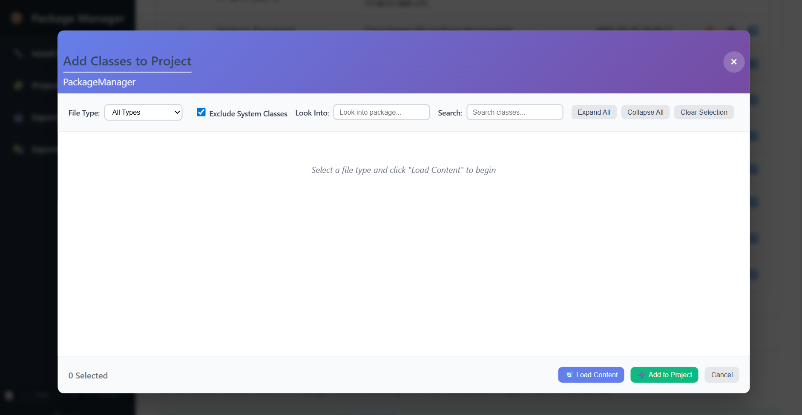
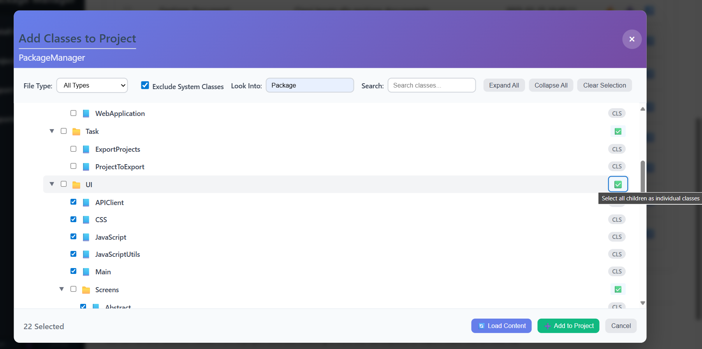
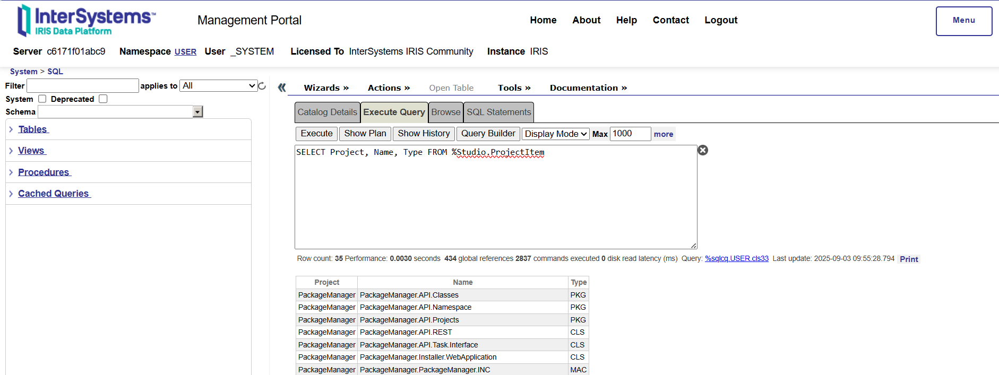
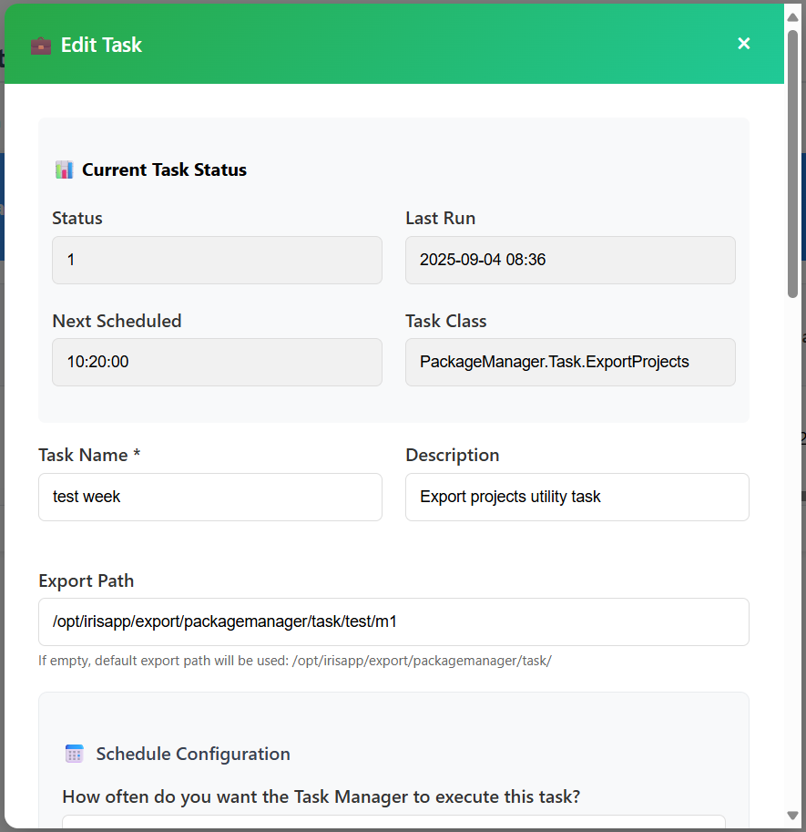

# 📦 Package Manager User Guide

This guide will walk you through setting up and using the Package Manager application.

Please be aware that all icons are rendered by your browser, so some may appear differently than they do in the pictures below.

## Table of Contents

* [📦 Package Manager User Guide](#-package-manager-user-guide)
* [🐳 Docker Setup](#-docker-setup)
  * [1. Building the Docker Image](#1-building-the-docker-image)
  * [2. Verifying the Docker Image](#2-verifying-the-docker-image)
  * [3. Checking the Running Container](#3-checking-the-running-container)
  * [4. Monitoring the Container Logs](#4-monitoring-the-container-logs)
  * [5. Inspecting Container Files and Volumes](#5-inspecting-container-files-and-volumes)
  * [6. Checking Source Code](#6-checking-source-code)
* [🖥️ User Workflow](#️-user-workflow)
  * [1. Accessing the Package Manager](#1-accessing-the-package-manager)
  * [2. Installing the API](#2-installing-the-api)
    * [2.1. Verifying API Installation](#21-verifying-api-installation)
  * [3. Managing Projects](#3-managing-projects)
    * [3.1. Creating a New Project](#31-creating-a-new-project)
    * [3.2. Adding Classes to the Project](#32-adding-classes-to-the-project)
    * [3.3. Understanding Project Items in InterSystems IRIS](#33-understanding-project-items-in-intersystems-iris)
    * [3.4. Viewing and Exporting Project Content](#34-viewing-and-exporting-project-content)
    * [3.5. Modifying your project&#39;s description](#35-modifying-your-projects-description)
    * [3.6. Deleting a Project](#36-deleting-a-project)
    * [3.7. Removing project items from a project](#37-removing-project-items-from-a-project)
  * [4. Automating Exports with Tasks 🤖](#4-automating-exports-with-tasks-)
    * [4.1. Creating a New Export Task](#41-creating-a-new-export-task)
    * [4.2. Configuring File Purging](#42-configuring-file-purging)
    * [4.3. Editing Tasks](#43-editing-tasks)
    * [4.4. Associating Projects with the Task](#44-associating-projects-with-the-task)
    * [4.5. Manually Running a Task](#45-manually-running-a-task)
  * [5. Exported Releases 📦](#5-exported-releases-)

# 🐳 Docker Setup

The application it's built on Docker, so we'll start there. You'll need to have Docker Desktop installed and running.

## 1. Building the Docker Image

To start, you need to build the Docker image. In your terminal, navigate to the directory containing the docker-compose.yml file and run the following command:

```
docker-compose up -d --build
```

This command reads the **docker-compose.yml** file and builds the image based on the specifications.

In the following example, we are going to build a container called **iris-packagemanager-test**:


## 2. Verifying the Docker Image

After running the command, Docker will create a new image. You can verify this by checking the Images section in Docker Desktop. You should see an image named **intersystems/iris-community** with the tag latest-cd.


## 3. Checking the Running Container

Next, check the Containers section. You should see a container named iris-packagemanager-test that is currently Running. You can also see the ports it's using, which are 9091:1972 and 9092:52773.


## 4. Monitoring the Container Logs

To see the application's startup process, click on the container name and go to the Logs tab. This shows the log output as the application initializes, compiles classes, and starts up. As you can see, all the source code has been correctly imported and compiled:


## 5. Inspecting Container Files and Volumes

In the container's details, you can also explore the file system and bind mounts. The Files tab lets you browse the files inside the container. The Bind mounts tab shows how local directories on your host machine are mapped to directories inside the container, such as the storage and exports folders.


## 6. Checking Source Code

From the Containers section, click on the running container and then on Files. You will see that your source code has been imported into the container ./opt/irisapp/src folder:


# 🖥️ User Workflow

Once the Docker container is running, you can access the application through your web browser.

## 1. Accessing the Package Manager

   Open your browser and navigate to [http://localhost:9092/csp/user/PackageManager.UI.Main.cls](http://localhost:9092/csp/user/PackageManager.UI.Main.cls). This CSP page is the main user interface for the application. You'll be greeted with a welcome page.
   

## 2. Installing the API

   Before you can use the application, you need to install the API. On the left sidebar, click on Install Package Manager. Initially, the API status will be shown as not installed.
   Click the Install API button. The application will install the necessary components.
   API installation is performed by directly calling another CSP page, without using any other API.
   

   When API is not installed, the other sections will report an error like the following:
   

### 2.1. Verifying API Installation

   After installation, the API status will update to installed and running. You'll see the last successful ping time, confirming that the API is ready for use.
   

## 3. Managing Projects

   Now you can start managing your projects by navigating to the Projects Content Viewer from the sidebar.
   You can now begin to add and manage projects within the application.

### 3.1. Creating a New Project

   To start, click on the **+ New Project** button in the **Projects List** section. If this is your first time, the screen will show "**No projects found**" with a large "**Create New Project**" button.
   

   A pop-up will appear. Enter a unique Project Name and an optional Description. For this guide, we'll name the project "**PackageManager**" and provide a description stating it contains the source code for the IRIS Package Manager. Click **+ Create Project**.
   

### 3.2. Adding Classes to the Project

   Your new project will now appear in the list. After creating the project, you need to add your code files. To do this, click the **Add Classes to Project** icon (a purple plus sign) under the "**Actions**" column for your project.
   

   This opens a new window:
   

   Use the **File Type** dropdown to select the type of files you want to add, like **Classes** (.cls), **Includes** (.inc), or **Macros** (.mac).
   You can also search for specific files by using the **Look Into** search box. Use this field to view the content of specific packages inside your namespace using the syntax `Package.SubPackage.Class`.
   Additionally, system files can be excluded from the results by enabling the **Exclude System Classes** flag (by default, all classes within packages that start with values listed in the list `systemClassesToExclude` of the `PackageManager.PackageManager.inc` file will be excluded).

   For this example, we'll select **All Types**, enable **Exclude System Classes**, look for classes within the `Package` package and load the content.
   The system will display a hierarchical tree view of all the files in your namespace. Browse through the folders and check the box next to the files you want to add to your project.
   To select all the files inside a pakage/file path you can click on the **Select all children** button
   

   Once you've selected your files, click the **+ Add to Project** button.

### 3.3. Understanding Project Items in InterSystems IRIS

   In InterSystems IRIS, a project consists of varioustems. These can include:

* Directories containing files like JavaScript, HTML, or images.
* Packages that contain classes (.cls) and routines.
* Individual files or classes.

  The key distinction is how you add these items to a project. You can either add an entire package or specific classes from that package.

  **Adding an Entire Package**
  When you set a whole package as a project item, all its content is automatically included in the project. This applies to all existing files and any new files or classes added to that package later on.

  **Adding Individual Classes**
  In contrast, if you add specific classes as project items, only those selected classes are included. The containing package itself is not added as a project item. This allows for more granular control over what a project contains.

  The following example illustrates the difference in how packages and classes are associated with a project as project items:
  

  **Important Rules for Project Items**
  InterSystems IRIS has a strict rule to prevent conflicts: a package and the classes it contains cannot both be project items for the same project.

  If you select a package as a project item, you cannot add its individual classes to the project separately. (Don't worry, the classes are already included because they're inside the package.)

  Similarly, you cannot delete a specific class from a project if the entire package was added as the project item.

### 3.4. Viewing and Exporting Project Content

   Now that your project contains files, you can view them by clicking the **Show Project Content** in the topbar of the **Project List** table. The viewer displays all the files you've added, categorized by type (**PKG** for classes, **DIR** for other files).
   The **Content Viewer** in InterSystems IRIS helps you identify how items are included. It uses different icons to distinguish between packages that are project items and those that are not. A **light bulb icon** indicates a package that is a project item, while a **black circle icon** is used for other packages.
   

   You can export specific files by checking the box next to them and clicking **Export Selected**. A download prompt will appear, allowing you to save the file as an XML.
   

   To export the entire project, return to the Projects List, select your project by checking the box next to its name, and click the **Export Selected Project** button. This exports the entire project as a single XML file.
   

### 3.5. Modifying your project's description

   It is possible to modify your project description by clicking on the pencil icon on the Project List section. The actions buttons will be replaced by new ones, allowing you to edit the project details.
   

### 3.6. Deleting a Project

   To delete a project, click the trash can icon that appears after entering edit mode (as shown in the image above, next to the "**Save Changes**" and "**Cancel**" buttons). This will remove the project from your list.

### 3.7. Removing project items from a project

   To remove project items from a project, go to the **Projects Content** section and select the items to remove from a project. Note that, if the entire package was added as the project item, you cannot remove a specific class from a project but you must remove the whole package. Packages added as project items can be identified by the **light bulb icon**.

## 4. Automating Exports with Tasks 🤖

   The Package Manager allows you to automate the export of your projects by creating and scheduling tasks.

### 4.1. Creating a New Export Task

   Navigate to the Export Project Task section in the sidebar. If you haven't created a task yet, you'll see a screen with a **+ Create New Task** button.
   Clicking this opens the Create New Task window. Here, you'll configure the task's schedule and details:
   

* **Task Name & Description**: Give your task a name, like "Daily Export", and a description to explain its purpose.
* **Schedule Configuration**: Choose how often you want the task to run. Options include Daily, Weekly, or Only Once. You can specify the frequency (e.g., Every 1 day) and a Run time.
  
* It's important to note that tasks, when run from the InterSystems IRIS Task Manager, will inherit the privileges and identity of the user who created them in the Package Manager (visible in the sidebar).

### 4.2. Configuring File Purging

   Within the same task creation window, you can enable automatic file purging to manage disk space.
   To configure it, simply check the box to activate the purging options. You will then set two key parameters:

* **Retention Time (in days)**: This value determines the lifespan of your exported files. Any file generated by this task that is older than the specified number of days will be automatically considered for deletion. For example, if you set this to 30 days, any export file older than one month will be targeted for removal.
* **Minimum Files to Keep**: This acts as a safety net. Even if some files exceed the Retention Time, the system will always retain at least this specified number of the most recent export files. This ensures that you always have a minimum historical record of your project, preventing the accidental deletion of all backups, even if they are very old.


* Please note that each task will delete only the files generated by itself (not from other tasks). This ensures that tasks operate independently and do not interfere with the exports managed by other scheduled tasks.
* Furthermore, purging is applied only to files associated with projects that are currently linked to that specific task. If a project is unassociated from a task, its previously exported files will no longer be subject to that task's purging rules.

### 4.3. Editing Tasks

   After creating the task, it will appear in the Existing Tasks list.
   

   You can click the edit icon (a pencil) to open the Edit Task window.
   

   The Task Control section lets you change all the task's configurations.
   

   Moreover, you can suspend the task by changing its status from Active to Suspended if you need to pause it.
   

### 4.4. Associating Projects with the Task

   To make the task functional, you need to link it to the projects you want to export. In the Edit Task window, click the folder icon under the "Projects" column. This opens the Manage Project Files window. On the right, you'll see a list of Available Projects in your file system. Click **Add** next to the project you want to associate with the task. The project will move to the "Associated Projects" list on the left.
   

   Click Save Changes to complete the association. The task is now configured to export the selected project automatically.

### 4.5. Manually Running a Task

   You can manually trigger a task run at any time. In the Existing Tasks list, click the Run icon (a play button) under the "Actions" column. A pop-up will ask you to confirm.
   Click OK to run the task.
   

   Tasks will report their last status each time they complete a run. This information, including the status of the last execution, is clearly displayed in the Export Project Task table, as shown below:
   

## 5. Exported Releases 📦

   After a task runs, the exported project is saved as a "release." You can find these in the Exported Release section of the sidebar. This page lists all the versions created by your export tasks.
   

   You can select and Download Selected releases from here.
   
